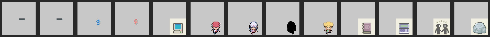
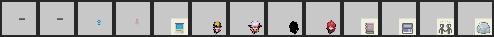

[Research](../../ResearchNotes.md) / Naming Screen Logic

# Naming Screen Logic, Diamond/Pearl, Platinum and HeartGold/SoulSilver

Source: the [pokeplatinum](https://github.com/pret/pokeplatinum) and [pokeheartgold](https://github.com/pret/pokeheartgold) decomps, cited by file and function, and the archive read from the US retail ROMs. This was structured into a document with AI.

The screen that names the player, the rival, a Pokémon, a box or a group shows a small picture beside the name and an underline under each letter. The pictures are sprite animations in the naming screen's archive; which one a screen shows is code.

## The archive

`namein` has 19 files in all three games (pokeplatinum's `res/graphics/naming_screen/`, loaded in `NamingScreen_LoadObjectGfx`). The ones used here:

| File | Content |
|---|---|
| 0 | background colours |
| 1 | sprite colours, nine palettes |
| 2 | background tiles |
| 4 | the top screen's map |
| 6 to 9 | the keyboard maps |
| 10 | sprite drawing |
| 12 | cells, 70 banks |
| 14 | animations, 61 sequences |

Every file but 0 and 1 is LZ compressed. The cells and animations are the same bytes in all three games; the sprite drawing and colours differ.

The animations beside the name:

| Animation | Platinum | HeartGold |
|---:|---|---|
| 43 | underline | same |
| 44 | underline under the current letter | same |
| 45, 46 | male, female symbol | same |
| 47 | PC | same |
| 48, 49 | Lucas, Dawn | Ethan, Lyra |
| 50 | a black silhouette, standing in for a Pokémon | same |
| 51 | Barry | Silver |
| 52 | a book, used by no screen | same |
| 53 | Pal Pad | same |
| 54 | two people, a group | same |
| 55 | a rock | same |

## Where things go

The picture sits at (24, 8). Each letter has an underline at x = 80 + 12 × the letter's place, y = 39, drawn with animation 43; the one at the cursor uses 44, which bobs. A Pokémon's gender symbol sits at x = 80 + 13 × the number of letters allowed, y = 27 (`NamingScreen_InitIconSprite`, `NamingScreen_UpdateTextCursors`).

**The Pokémon picture is replaced, not drawn over.** On the Pokémon screen the game copies the Pokémon's own party icon into sprite tiles 703 to 718 and its palette into slot 6 (`NamingScreen_LoadMonIcon` in pokeplatinum, `src/naming_screen.c` in pokeheartgold). Animation 50's cells point at tile 703 and palette 6, so what the archive has there never shows.

## Which picture a screen shows

`NamingScreen_InitIconSprite` in both games picks it by the screen's type (`include/applications/naming_screen.h` in pokeplatinum, `include/launch_application.h` in pokeheartgold):

| Type | Animation | Platinum callers, letters | HeartGold callers, letters |
|---|---|---|---|
| 0 Player | 48 boy, 49 girl | the new game intro and a script command (7); the Battle Frontier (8) | Oak's speech and a script command (7); overlay 80 (8) |
| 1 Pokémon | 50, with 45 or 46 | egg hatching, catching, a script command (10) | the same (10) |
| 2 Box | 47 | the PC (8) | the PC (8) |
| 3 Rival | 51 | the new game intro (7) | Oak's speech and a script command (7) |
| 4 | 53 | no caller found | no caller found |
| 5 Group | 54 | the record mix group name (7) | the same (7) |
| 6 Rock | 55 | Route 224's Shaymin tablet (`ScrCmd_OpenShayminTabletNamingScreen`, 10) | no caller found |
| 7 Pal Pad | 53 | the Pal Pad (7) | the Pal Pad |

The letter limits are `MON_NAME_LEN` 10, `TRAINER_NAME_LEN` 7 and 8 for a box (`include/constants/string.h`). Diamond and Pearl share the cells and animations, but their naming code is only assembly in pokediamond, so which picture each of their screens shows is inferred from Platinum rather than read.

## What DSPRE does

The pictures are edited in the Naming Screen editor, on the Tools menu behind the beta gate (it opens with the Trainer Sprite Editor's gate), through the Trainer Sprite Editor's painter (`NamingScreenIcons` in `DSPRE.Core/ROMFiles`). It lists ten pictures, 48, 49, 51, 47, 54, 53, 55, 50, 45 and 46, each with its screen's letter count, and uses the game's positions. The drawing, file 10, is painted a cell at a time for the chosen animation and written back compressed; the colours, file 1, are written only when changed. The preview draws the game's own top bar from files 2, 0 and 4, the underlines and the picture playing, and a sample name in the ROM's font.

It does not edit the cells or animations, the positions, the letter counts, which picture a screen uses, the background or the keyboard. Painting the Pokémon silhouette, animation 50, has no effect in game, since the Pokémon's icon replaces it. The current-letter underline (44), the unused book (52) and the eight-letter player screen are not listed.
