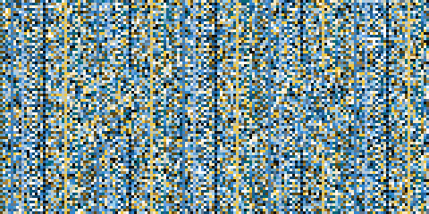
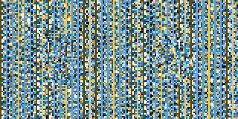
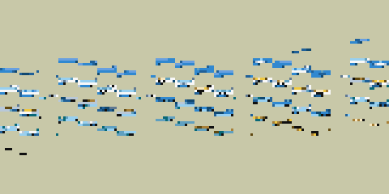
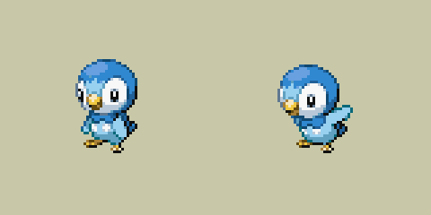
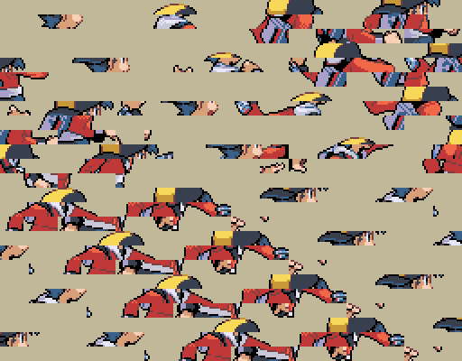
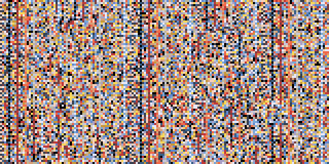
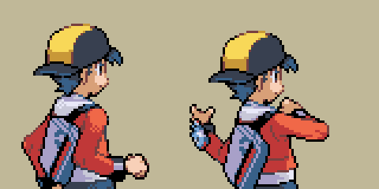

[Research](../../ResearchNotes.md) / Battle Sprite Cipher and Scan

# Battle Sprite Cipher and Scan, Diamond/Pearl, Platinum and HeartGold/SoulSilver

Source: the [pokeplatinum](https://github.com/pret/pokeplatinum), [pokeheartgold](https://github.com/pret/pokeheartgold) and [pokediamond](https://github.com/pret/pokediamond) decomps, cited by file and function, and the archives read from the US retail ROMs (Diamond v05, Platinum revision 1, HeartGold). This was structured into a document with AI.

Pokémon battle sprites, and the trainer sprites' still pictures, are stored as 160 × 80 pixel images whose pixel data is encrypted with a simple running key. Read without the key they are static; read with the key but as ordinary 8 × 8 tiles they are smears; only read with the key and in straight lines do they come out as a picture.

## How the cipher works

The pixel data is 3,200 u16 words, 160 × 80 at 4 bits a pixel. Each word is XORed with the low 16 bits of a key, and the key then steps as key × 1103515245 + 24691 (`0x41C64E6D`, `0x6073`): `PokemonSprite_LCRNGNext` and `PokemonSprite_Decrypt` in pokeplatinum `src/pokemon_sprite.c`, `lcrngUpdate` and `UnscanPokepic` in pokeheartgold `src/pokepic.c`, `sub_02008A54` and `sub_02008A74` in pokediamond `arm9/src/unk_02006D98.c`.

It runs one of two ways:

- **Forward**: the key starts as word 0 and the words are decoded from the first up.
- **Backward**: the key starts as word 3199 and the words are decoded from the last down.

Either way the word the key comes from decodes to 0, so the first four pixels (forward) or the last four (backward) of every sprite are colour 0.

| Game | Backward | Forward |
|---|---|---|
| Diamond, Pearl | everything: `pokegra.narc`, `otherpoke.narc`, `trfgra.narc`, `trbgra.narc` | |
| Platinum | `pokegra.narc` and `otherpoke.narc` (the Diamond copies) | `pl_pokegra.narc`, `pl_otherpoke.narc`, and file 4 of each trainer in `trfgra.narc` and `trbgra.narc` |
| HeartGold | `pbr/pokegra.narc`, `pbr/otherpoke.narc`, and file 4 of each trainer in `a/0/5/8` (fronts) and `a/0/0/6` (backs) | `a/0/0/4`, `a/1/1/4` |

The directions are from the decomps (`pokemon_sprite.c`, `pokepic.c`) and every member of every archive in the table was checked against the retail ROMs by decoding it both ways; only members 0 to 3 of each Pokémon archive, the empty species 0 slot, read as noise either way.

A Pokémon archive keeps six files per species: back female, back male, front female, front male, normal colours, shiny colours. Platinum and HeartGold also ship the Diamond sprites, which their own sprite code does not use: Platinum's dress-up photo reads them (`Pokemon_BuildSpriteTemplateDP`), and HeartGold builds one from `pbr/pokegra.narc` in a function whose only caller is in overlay 41. All 2,964 members match between Diamond, Platinum's copy and HeartGold's copy except one, species 379's front male.

## What it looks like

A Platinum Piplup front sprite, `pl_pokegra.narc` member 2361 (species 393 × 6 + 3), read four ways:

| Read | Picture |
|---|---|
| raw, still ciphered |  |
| deciphered in the wrong direction |  |
| deciphered, drawn as 8 × 8 tiles |  |
| deciphered, drawn in straight lines |  |

HeartGold's `a/0/0/4` member 2361 is the same bytes. Diamond's needs the backward direction.

## Trainer sprites and the scan

In Platinum and HeartGold a trainer is five files. File 0, the drawing, is a sprite sheet in the order the cells are copied to video memory, and is not ciphered; drawn as a flat sheet its poses are scattered. File 4, the scan, is a linear 160 × 80 picture like a Pokémon's, ciphered, with the first frame on the left and the second on the right.

| File | Picture |
|---|---|
| HeartGold `a/0/0/6` entry 0 (Ethan's back), file 0, drawn as a flat sheet |  |
| the same entry's file 4, still ciphered |  |
| file 4 deciphered backward |  |

Platinum's `trbgra.narc` entry 0 (Lucas) gives the same three, with the forward cipher.

**Where the scan is drawn.** HeartGold loads it as file `class × 5 + 4` (`sub_02070D3C` in pokeheartgold `src/pokemon.c`). The back sprite is picked by `TrainerClassToBackpicID`: Ethan and Lyra are 0 and 1, or 15 and 16 when a flag is set. Ordinary single battles draw the animated back from 15 or 16 but the slide-in from entry 0's scan, which is why editing entry 0's frames alone does not show in a HeartGold battle ([Trainer Sprites](../TrainerSprites/TrainerSpritesLogic.md)).

**What the scan holds.** For most sprites the left half is the middle 80 × 80 of the first frame, drawn from cell bank 0 on a 128 × 128 canvas with the cell origin at its centre, and the right half is the second frame, from bank 1, or blank for a sprite with one frame. Measured over the retail ROMs this holds for every Platinum back (11), 16 of HeartGold's 17 backs, 87 of Platinum's 105 fronts and 119 of HeartGold's 129. The exceptions, by trainer entry:

| Game | Entries | How they differ |
|---|---|---|
| Platinum fronts | 63, 64, 67, 76 | the right half is bank 2 |
| Platinum fronts | 65, 74, 75, 77, 78, 79 | built from other banks |
| Platinum fronts | 62, 90, 91, 94, 100, 101, 102 | a half matches no bank |
| HeartGold fronts | 3, 34, 60, 70 | the left half is 3 to 13 pixels off |
| HeartGold fronts | 99 to 102, 106, 123 | a half matches no bank |
| HeartGold back | 3 (Lance) | a half matches no bank |

## What DSPRE does

The cipher is `SpriteScrambling` in `DSPRE.Core`, with the direction taken from the game (Diamond and Pearl backward) unless a caller asks for one. `TrainerGraphicsLayout` knows that Diamond's trainer drawings are ciphered and that the scans run backward everywhere but Platinum. The Pokémon Sprite Editor carries its own copy, writing a seed of 0 in Platinum and HeartGold and the game's own seed in Diamond. The Graphics browser and its painter decipher the Pokémon archives, and in the trainer archives file 4 in Platinum and HeartGold or every drawing in Diamond.

The Trainer Sprite Editor rebuilds the scan every time a Platinum or HeartGold trainer is saved: the middle 80 × 80 of frames 0 and 1, the right half blank for a sprite with one frame, ciphered in the game's direction (`WriteScan`), and for each linked HeartGold pair, 0 with 15 and 1 with 16. For the exceptions above, that first save replaces the retail scan halves with frames 0 and 1, even when only the colours changed.

DSPRE edits the archives each game's own battles use; the Diamond copies inside Platinum and HeartGold are left as they are.
